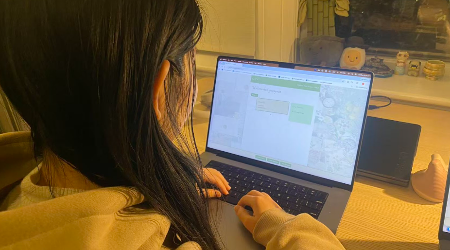
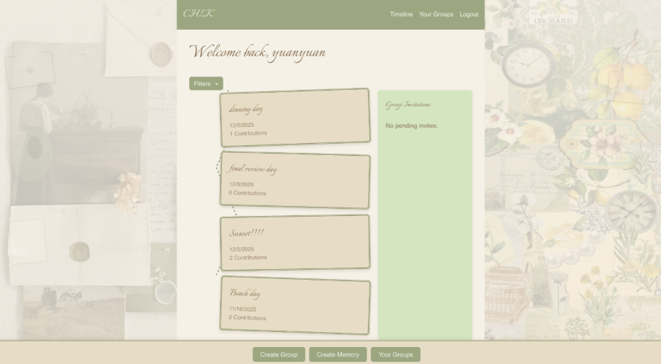
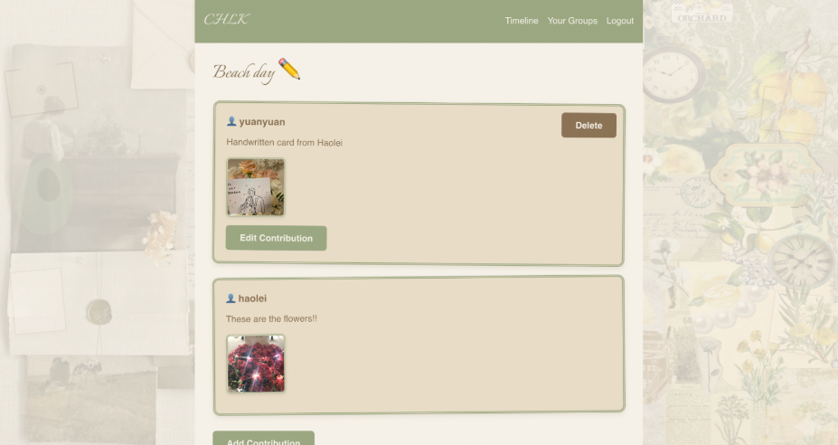

# User Testing

## Task List: Instructions & Rationale

| Task | Instruction (User-Facing) | Rationale (Research-Facing) |
|------|---------------------------|------------------------------|
| 1. Register, Log In & Create a New Group | "Go to the provided URL, register a new account, log in, and create your first memory group with a friend." | Tests the onboarding flow, first-time comprehension of "group" concept, and whether users understand how group creation relates to collaborative memory. Reveals potential confusion around usernames and mental model of social setup. |
| 2. Invite a Friend & Return to Timeline | "Invite your friend using their username, then return to the timeline view." | Evaluates usability of the invitation workflow and checks if navigation between core views (Group vs. Timeline) is intuitive. |
| 3. Create Your First Memory & View Friend's Contribution | "Create a memory with a title, description, and image. Then view a memory your friend added." | Tests core functionality of memory creation and collaboration. Assesses whether users understand where memories live (group vs. timeline) and how content flows between pages. |
| 4. Manage Memories (Edit/Add/Delete) | "Edit an existing memory, add a new memory, and delete a memory within this group." | Evaluates ease of modification and control over content. Confirms whether UI conventions align with familiar social media interaction patterns. |
| 5. Accept an Invitation to Another Group & Explore Content | "Accept a group invitation when it appears in the timeline, then explore and contribute to this new group." | Tests understanding of multi-group interactions and clarity in invitation context. Shows how users manage multiple collaboration spaces. |
| 6. Explore Filters, Create More Memories & Leave a Group | "Experiment with filters, add memories across multiple groups, and optionally leave a group. Fully try the app as you want!" | Tests advanced functionalities and autonomy in system exploration. Reveals whether users feel fully in control of organizing and navigating memories. |

## Summary of Lessons From User Testing

User Study Findings – Key Insights

### Task 1

Users completed registration and login smoothly due to familiarity with standard UI patterns.
However, they hesitated when choosing a username, unsure whether to use real names, emails, or screen names, which is a  signaling unclear guidance about how usernames are used for invitation and identity.
Users also questioned whether they should add friends first (like social media) or create a group directly, indicating the app’s collaboration model may not yet feel distinct from a social network.

The second user had a username provided to them, so that they would be pre-invited to groups that they could choose to accept or reject. However, as the website is on Render’s free plan, it took a while to load, which caused the user to be frustrated and believe the app is not working, instead deciding to mash it several times. While creating a group, the user experienced similar lag, and decided to mash the button. This inadvertently caused several groups of the same name to be created.

### Task 2

Inviting a friend was straightforward. Returning to the timeline caused confusion. Users expected the timeline to be inside the group rather than the app-wide “home” space. This reflects a mismatch between UI structure and user mental models of content hierarchy.

Other users were confused on how to return to the homepage– they believed that “Timeline” is separate from “Homepage”and is not the same thing. They believed the CHLK in the upper left corner was more indicative of a Homepage feature than the “Timeline” button. Renaming the “Timeline”button to “Timeline | Homepage” would be more helpful.

### Task 3

Users could post memories, but the system logic felt unclear:

**Expected flow**: Group → Create Memory → View in Timeline

**Actual interaction**: Group → Timeline → Create Memory → View in Timeline

Users suggested offering two navigational pathways (by group or by timeline), similar to Discord channels vs. global feeds. They also struggled to know where they were in the flow, indicating a need for better wayfinding cues (breadcrumbs, labeling, onboarding hints).

Other users were confused about “Memories” as a concept– believing Memories to be generic posts and the Contributions underneath to be the memories themselves.

Moreover, when adding a Memory, the date autofilled, but was not actually inputted into the form, which caused the adding memory button to break. Once the person manually typed in the date, the add Memory function worked properly.

### Task 4

Users performed well editing and managing posts (thanks to familiar conventions borrowed from Instagram/Facebook). This demonstrates the value of a guided first experience: after Task 3, confidence and speed increased noticeably.

### Task 5

Users enjoyed joining a second group but were unsure what the new group was based on its name alone. They recommended adding contextual description to invitations so users can quickly understand the purpose.

When users wanted to see the memories associated with a particular group, they did not use the filter, as intended, they instead navigated to the “Your Groups” thread and clicked on a group name, and were confused on how to find the posts they wanted.

### Task 6

Users used filters and settings independently, showing positive user empowerment when the structure was already familiar.

Navigating multiple groups still required cognitive effort, reinforcing a need for stronger conceptual clarity between local vs. global content.

Once the users found the filter, they took to it like a fish to water, and praised the feature, thinking it was unique and clever. In particular, they said (and asked me to put it in emoji form) "🦖🛫💥✨💅”.

## Flaws / Opportunities for Improvement

Users experienced confusion when creating their usernames because they were unsure whether to use a real name, email, or a casual screen name. Since usernames are important for invitations and identity in the app, clearer guidance and examples during registration would help set expectations.

When creating groups, users would be frustrated at the lag, causing them to mash the button several times, which created multiple groups of the same name and with the same people. It would be helpful to add a feature that, per user, you cannot create groups with the same name, to help mitigate this flaw.

Some participants approached the app using a social-media mindset, expecting to add friends first before creating a shared space. This shows that the concept of groups as the primary structure for collaboration is not yet obvious. A brief onboarding explanation could clarify that the app functions more like a collaborative memory tool rather than a traditional social network.

Navigation between the group view and the timeline also caused uncertainty. Users thought the timeline belonged inside a group, rather than serving as a global home for all activity. Strengthening visual hierarchy and labeling could better communicate where the user is and what content they are viewing.
Users were unclear how to return to the “Homepage”, not realizing that the Timeline is the homepage, so renaming “Timeline” to “Timeline | Homepage” would be beneficial.

Additionally, users were sometimes unsure about the correct sequence of actions when creating memories. Providing subtle step guidance or a first-time tutorial would reduce guesswork and support confidence during initial use.

As users instinctively navigate to the group itself to view its memories (or “posts”, as one user put it), à la Facebook, it would be helpful to add a button in said groups that redirected them to the timeline but with a filter showing no other groups except the one they clicked on. It may also be helpful to add a “date created” and “new!”highlight to show when a memory was created, and if today, have “new!” displayed, to help guide the user to not have to search ones they’ve already seen.

Finally, group invitations felt unclear because group names alone did not convey their purpose. Adding a short description or showing who created the group would help users quickly understand the context and make more informed decisions when joining.

The date autofill confused a user, and made it seem like the app is not working properly, as although it had seemed like the app had autofilled a date, the date hadn’t actually been written in there, and the memory failed to be created. Make the memory dates more clear– if it is autofilled, make it clear that it hasn’t actually been inputted yet, and is a mere suggestion/example of a date rather than already having been inputted.

As users were frustrated at the lag, like when creating a memory, creating a group, or logging in, which confused them and made them think it was not working properly, a helpful feature would be a loading bar, that shows them that the app is actively working on it and not freezing/not doing anything, which would make the user less frustrated.

## User 1: yuanyuan

## User 2 (preferred not to have a photo taken on account of a messy room): Ariana

