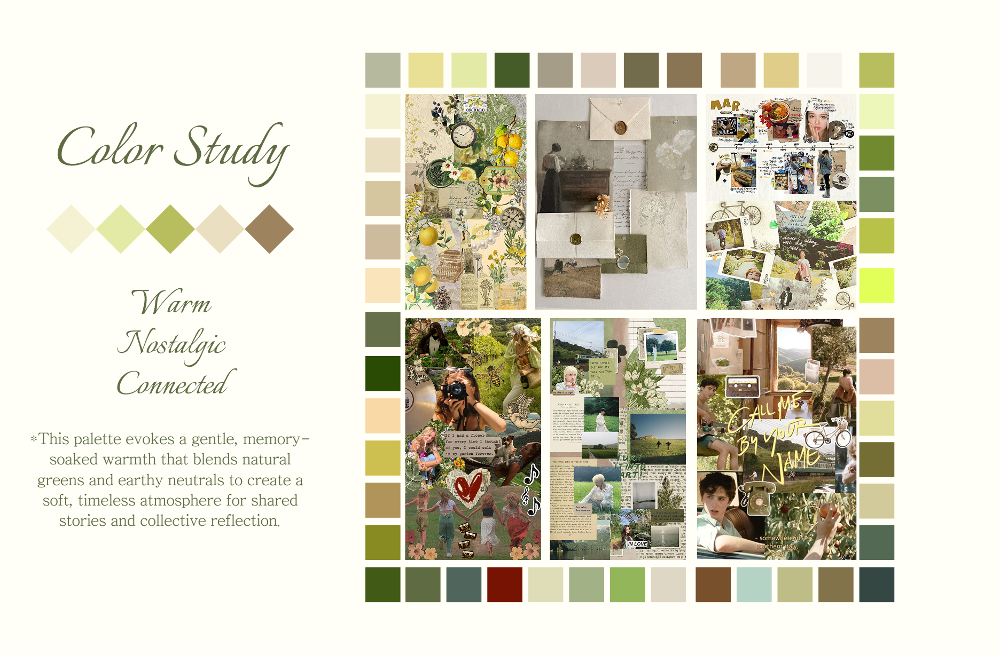
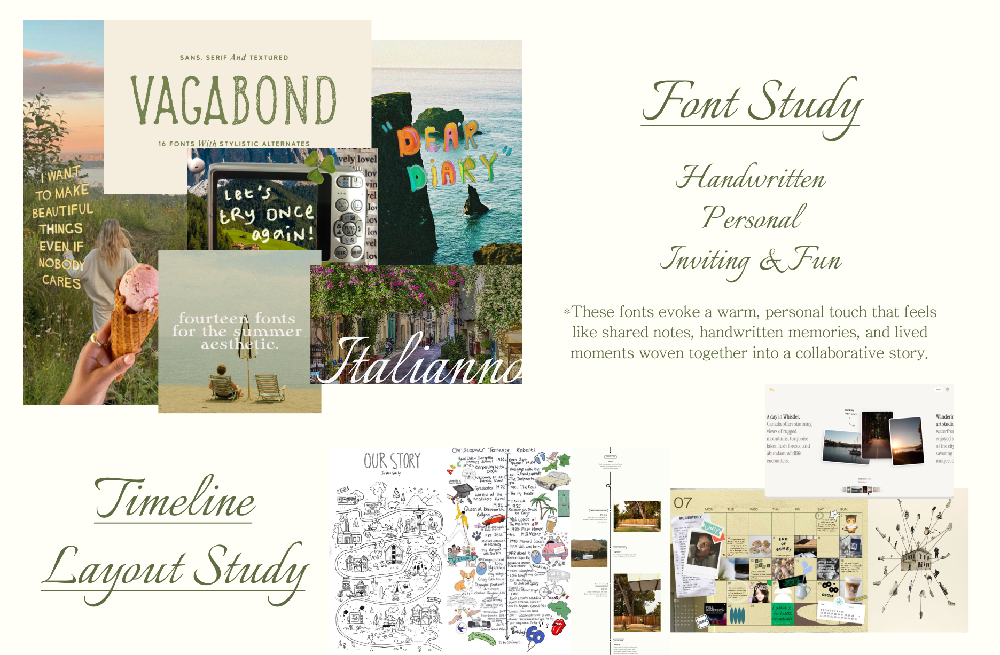

# Visual Study

Learn from color study, we want to conduct a feeling of warm, nostalgic, and connected. This palette evokes a gentle, memory-soaked warmth that blends natural greens and earthy neutrals to create a soft, timeless atmosphere for shared stories and collective reflection.

These fonts evoke a warm, personal touch that feels like shared notes, handwritten memories, and lived moments woven together into a collaborative story. The layout study we focused on timeline design which will be a leading design UI format for our app.

